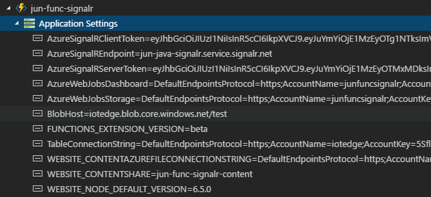

# Realtime Sign-in Example using Azure SignalR Service

This sample application shows how to build a realtime application using Azure SignalR Service and serverless architecture. When you open the homepage of the application, you will see how many people have visited this page (and their OS and browser distribution) and the page will automatically update when others open the same page.

A live demo can be found [here](https://signalrsignin.azurewebsites.net).

## How Does It Work

The application is built on top of Azure SignalR Service, Functions and Storage. There is no web server needed in this sample.

Here is a diagram that illustrates the structure of this appliaction:


1. When user opens the homepage, a HTTP call will be made to an API exposed by Azure Function HTTP trigger, which will record your information and save it to Azure table storage.
2. This API also returns a url and token for browser to connect to Azure SignalR Service.
3. Then the API calculate statistics information (number of visits, OS and browser distribution) and use Azure SignalR Service to broadcast to all clients so browser can do a realtime update without need to do a refresh.
4. The static content (homepage, scripts) are stored in Azure blob storage and exposed to user through Azure Function proxy.

## Deploy to Azure

### Deploy Static Files (Or just use Azure Storage Explorer to upload with ease)

1. Create storage account

   ```
   az storage account create \
      --location <location> \
      --name <account_name> \
      --resource-group <resource_group> \
      --sku Standard_LRS
   ```

2. Create container and table

   ```
   az storage table create --account-name <account_name> --name SignInInfo
   az storage container create --account-name <account_name> --name content --public-access blob
   ```
**> Note:** Please take note of the endpoints created in the previous commands, as you will need it later to add to the Function App's application settings.

3. Navigate to the ```/content``` folder and upload the static files

   ```
   az storage blob upload -c content --account-name <account_name> -n index.html -f index.html
   az storage blob upload -c content --account-name <account_name> -n scripts/signalr.min.js -f scripts/signalr.min.js
   az storage blob upload -c content --account-name <account_name> -n scripts/qrcode.min.js -f scripts/qrcode.min.js
   az storage blob upload -c content --account-name <account_name> -n images/signalr-logo.png -f images/signalr-logo.png
   ```
### Generate JWT Bearear Token

1. Open the `JwtBearerToken` folder in VS

2. In Program.cs, replace the value of endpoint and key of signalr service

3. Run the solution to get `AzureSignalRServerToken` and `AzureSignalRClientToken`

### Deploy Azure Function

1. Install Azure Functions VS Code Extension

2. Right-click on the `function-java` folder to deploy 

5. Update application settings



Note: 
* ```TableConnectionString``` can be located in the Azure Portal from the Access Key section of the created storage account.
* ```BlobHost``` is the blob service endpoint hostname (without https://), which you can find in the Blob Service Containers section: e.g. *****.blob.core.windows.net/folder_name
* ```AzureSignalREndpoint```: get from Azure portal.
* ```AzureSignalRServerToken```: get from `JwtBearerToken` solution.
* ```AzureSignalRClientToken```: get from `JwtBearerToken` solution.


## Run the application

Go to the url that was deployed as part of your Function App:

   ```
   https://<function_name>.azurewebsites.net/
   ``` 

It should show you an output similar to this:


## Brief Explanation

What's happening behind the scene is Azure SignalR Service exposed a set of REST APIs to for you to send message to clients. For example, the API that broadcasts message to all clients is exposed through this endpoint:

```
POST https://<service_endpoint>:5002/api/v1-preview/hub/<hub_name>
```

The body of the request is a JSON object with two properties:

1. `target`: The target method you want to call in clients.
2. `arguments`: an array of arguments you want to send to clients.

The service authenticates REST call using JWT token, when you're generating the JWT token, make sure the audience is same as the REST API url and use the access key in SignalR service connection string as th secret key. Then put it in authentication header:

```
Authorization: Bearer <jwt_token>
```

> Refer to `GenerateJwtBearer()` in [AzureSignalR.cs](function/AzureSignalR.cs) for a sample to generate JWT token in C#.

If the API call succeeds, it returns 202 (Accepted).

Clients also connect to SignalR service using JWT token, since there is no web server to generate the token, you'll need to do it in Azure function as well.

1. The JWT token is generated using the same algorithm described above, just the audience should be the url of the client hub.
2. Client hub is the following format:

   ```
   https://<service_endpoint>:5001/client/?hub=<hubName>
   ```

   This is also the endpoint client should connect to using SignalR client SDK.
